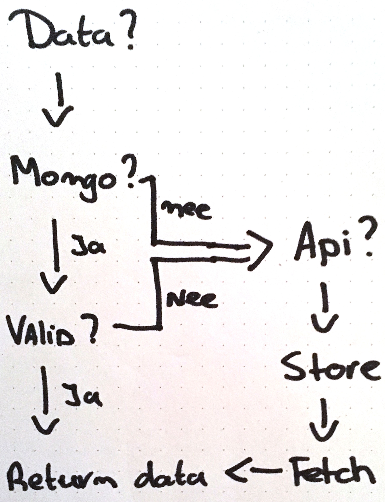

# Github Organisation Explorer
> This is a real-time version of the [server-side Github organisation explorer](https://github.com/vandijkstef/performance-matters-server-side).

This app can be linked to a GitHub organisation to explore information about it. View the repositories and forks within that organisation. This was created as part of the Webdevelopment Minor at CMD Amsterdam.

<!-- Add a nice image here at the end of the week, showing off your shiny frontend 📸 -->

<!-- Maybe a table of contents here? 📚 -->

## Getting started
### Prerequisites
This project assumes you are familiar with NodeJS (`9.11.1`) and NPM (`5.6.0`), and have those installed. Also, MongoDB (`3.6.4`) is assumed to be installed. Client side you would need a browser that supports `JS ES6 Modules` and `WebSocket`.

### Code style
All JS should conform to the eslint config thats included. Please make sure ESlint is functional in your code editor and the supplied config is being used.

Any data object handled in the system should be prefixed with its origin:
- `data` for MongoDB (`dataRepos`)
- `git` for Github (`gitRepos`)

### Installation and running
After cloning the project, install using:
```
npm install
```

The app requires no building. SCSS is compiled on runtime

Before starting the application, make sure MongoDB is running:
```
npm run mongo
```

Aftwards, start the app using:
```
npm start
```
Additionally, you can also watch the app using Nodemon:
```
npm run watch
```

### Deployment
The root of the project contains an `.env-example` file. Rename this to `.env` and set the variables for your envoirement.

Additional settings are defined in `.json` files in the root. This to not create a complete back-end for the app.

## Features (Wishlist)
This project tries to be a social platform around the CMDA Github organisation. Soon to be released features:
- 🔍 Github organisation Repo explorer 
- 🔎 Repo forks explorer 
- 💯 Awesome relevant data and numbers
- 🔢 Even more irrelevant data and numbers 
- 🔏 Github user login through oAuth
- 🍌 Fully featured profile page
- 👋 Online status display (for logged in users) 
- 💬 Chat system 
- #️⃣  Slack Integration
- 🐦 Twitter things? 
- 😵 Possibly class management stuff... 

## API's
### Github
Github is our main data source, and any other feature in the system will only work when that data is (or was) available through Github. Repos won't show up unless they are created, users won't be able to log in untill they made at least a fork and commit, etc. 
Requested from Github:
- Repos in the organisation
	- name, description, urls, owner
- Forks on those repos
	- name, description, urls, owner, commit-count
- Users on those forks
	- name, description, urls, avatar

## Server Caching (DB)
Data fetched from API's is cached on the server using MongoDB. Any data request within the system will first try to fetch that from the database. In the case the data doesn't exsist, or is invalid due to cache timeout, a (new) request to the API is made. That data is first stored, then fetched again from the database.

To reduce the amount of requests that are delayed by external API's, the system will periodically fake those requests using `./scripts/tick.js`.

## Contributing
Currently, no contributions are accepted. However, you are free to fork the project and build on it.

## Licence
<!-- How about a license here?  (or is it a licence?) 🤷 -->
This project is copyleft, all wrongs reversed. Have fun! *Note: This might not be true for dependencies*

## Acknowledgments
* ☕️️️️☕️️️️

<!-- * Create a "live" web app which reflects changes to the back-end data model in reactive front-end views, using real-time, event-based, messaging technologies like sockets or server-sent-events. -->
<!-- * Describe their work in a professional readme with insightful diagrams showing the life cycle of their data. -->

---


Notes Random:
- Keep track of api calls in DB, so we can decide if we wanna do deep calls or not

- Test if my update method actually updates and doesn't remove extra set variables

- So...
- To get all other users, we need to fetch the forks first
	- Then we possibly need to do a deeper call to actually fetch those users?
	- Or can we expand?
	- Don't I want to get all the data from the expand method?
- Then I can build a users page
- I guess I wanna run some API calls on startup so we get users, even on a clear database
- Wait, UserStore.FetchAll should fix that
	- Oh, we might not wanna return sensitive data to the template engine

Forks... Do I append them to the repo, or make their own table for it?
When I append them, its one big data blob
Forks are also used by individual users (get all forks from user X), so, yes, I want them seperated

TODO WD:
Group repos into classes
Neem mee
- content inventarisatie
- user scenario’s
en een demootje ... (?)

Note session:
If I create a public /session front to fetch the public user session data...
If I get it from the server... nope
So, I have to fetch it from front and handshake with that?
That makes the client aware of it's session
Is it a problem?
No, because it's based on your session, its a whole other problem if someone can takeover sessions.
And I immediatly send it to the socket server as soon as I fetched it.

Notes Larissa:
Nieuwe website
eerst koppenlijst opvragen, daarna lijsten, daarna links
Mental modal -> Verwachtingen, lastig zonder zicht
Niet ingewikkeld (structuur), skip to content is heel fijn.
Consistentie!
Iframes zijn not-done, kom je niet meer uit als je erin zit met je toetsenbord
alt teksten, omschrijvende links en kopjes
als alt leeg is, leest hij de complete img src voor
JS icm screenreader
iphone met brailleleesregel -> Bluetooth
	40 tekens op leesregel
